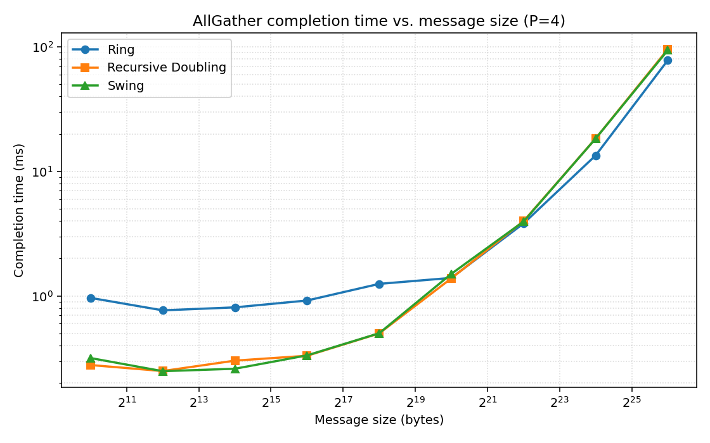
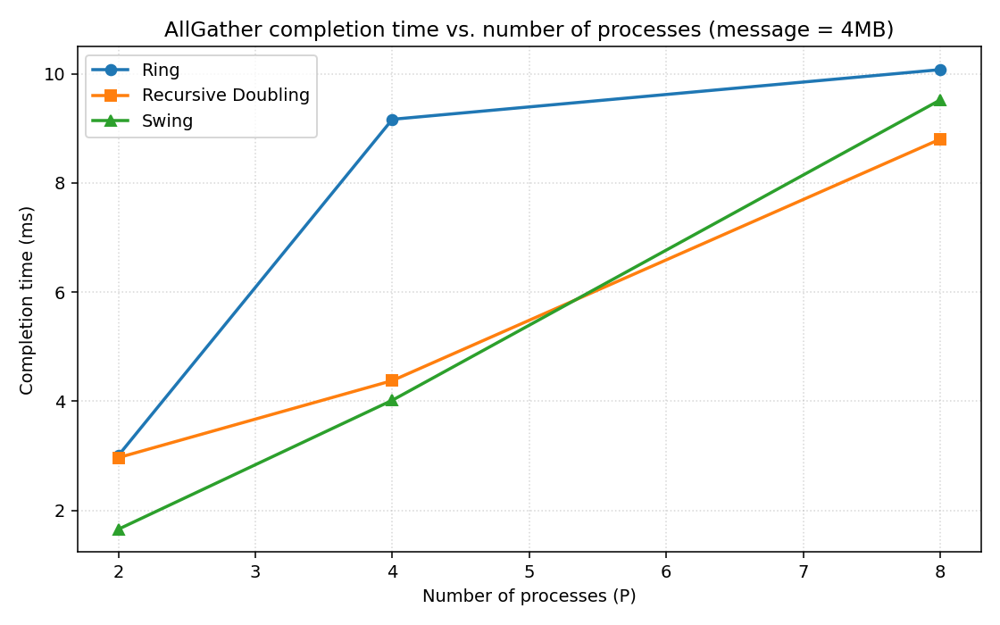
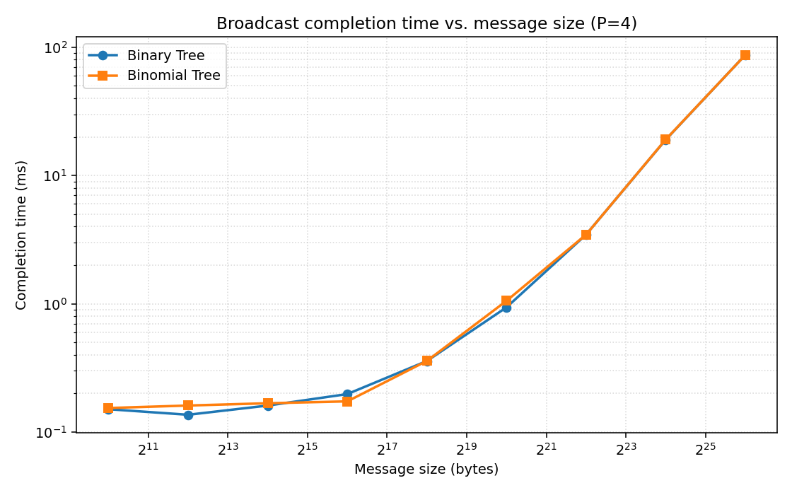
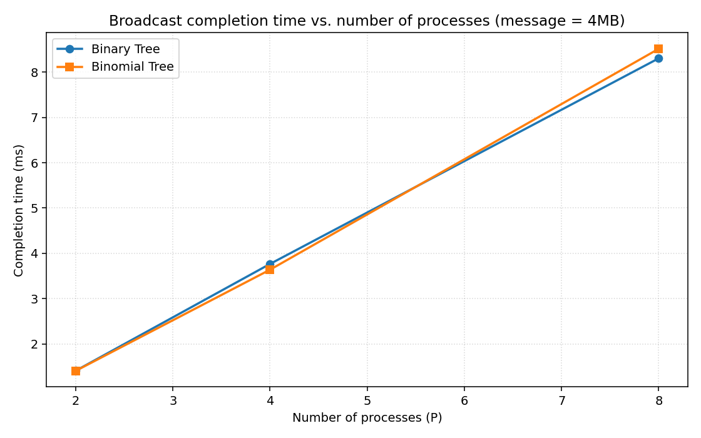

# CS 536 — Assignment 5: Collective Communication

**Author:** Arav Popli Pranay Nandkeolyar
**Date:** 2026-04-23

---

## 1. Overview

This report covers custom implementations of five collective‑communication
algorithms over the PyTorch `torch.distributed` **gloo** backend, together
with an experimental evaluation across message sizes and process counts.

Algorithms implemented (see `collectives.py`):

| Collective | Algorithms |
|------------|------------|
| AllGather  | Ring, Recursive Doubling, Swing |
| Broadcast  | Binary Tree, Binomial Tree |

Every algorithm is built from the point‑to‑point primitives `dist.send`,
`dist.recv`, `dist.isend`, `dist.irecv` only — the built‑in collectives
are never used inside the algorithms under test.

## 2. Algorithm descriptions

### 2.1 AllGather

Each of P processes starts with one chunk of size `C`. After the
collective, every process holds all P chunks in rank order.

**Ring** — P − 1 rounds. At round *s* every rank sends the slot it just
received (or its own chunk at *s* = 0) to `(rank + 1) mod P` and
receives from `(rank − 1) mod P`. Total data per rank: (P − 1)·C.
Good bandwidth efficiency, high latency (linear in P).

**Recursive Doubling** — log₂P rounds. At round *i* rank *r* exchanges
its currently‑held block of size `2ⁱ · C` with peer `r XOR 2ⁱ`. Requires
P to be a power of two. Data per rank: (P − 1)·C, same as ring; however
only log₂P rounds, so latency is logarithmic.

**Swing** — log₂P rounds with alternating‑direction doubling peers.
At round *i* the signed distance is dᵢ = (−2)ⁱ (i.e. 1, −2, 4, −8, …).
Rank *r* sends its accumulated chunk set to `(r + dᵢ) mod P` and
receives from `(r − dᵢ) mod P`; partial‑sum subsets of the distance
sequence cover every residue class mod P = 2ⁿ, so the algorithm finishes
in exactly log₂P rounds. The alternating sign shortens the longest
logical hop versus pure recursive doubling on ring/torus fabrics while
keeping the same data volume.

> Note: the original Swing paper (Di Girolamo et al., 2023) uses
> Jacobsthal distances `[+1, −1, +3, −5, +11, …]`, which are designed
> for AllReduce on torus topologies. Those distances do not form a
> spanning set for AllGather at every P = 2ⁿ (e.g. P = 4 yields only
> 3 of 4 ranks). The `dᵢ = (−2)ⁱ` variant used here preserves the
> swing pattern of direction alternation while guaranteeing correctness
> at every power‑of‑two P.

### 2.2 Broadcast

Root rank distributes one tensor to every other rank.

**Binary Tree** — a heap‑shaped binary tree rooted at the broadcast
root. Logical index `i = (rank − root) mod P`; parent `⌊(i−1)/2⌋`,
children `2i+1, 2i+2`. A rank forwards the data to each in‑range child
after receiving. Depth = ⌈log₂P⌉, fan‑out = 2.

**Binomial Tree** — ⌈log₂P⌉ rounds. At round *i* every rank that
already holds the data and whose logical index is `< 2ⁱ` sends to peer
`logical + 2ⁱ` if that peer exists. The tree thus doubles in size
every round. Depth matches the binary tree, but the root's out‑degree
grows each round rather than being capped at 2.

## 3. Implementation notes

* `collectives.py` — algorithms themselves.
* `test_correctness.py` — spawns 2, 4, 8 ranks and checks every
  algorithm's output against the mathematically expected value for
  several roots (all tests pass).
* `run_experiments.py` — driver that launches P gloo workers via
  `torch.multiprocessing.spawn`, runs 1 warm‑up + 3 timed iterations
  for every (algorithm, size, P) cell, and writes `results.json`.
* `plot_results.py` — renders the four required plots from
  `results.json` into `plots/`.

**Timing.** A barrier synchronises all ranks before the start of each
iteration; each rank records `perf_counter()` deltas. The per‑cell
completion time is the **median** across trials of the **max across
ranks** (a collective is only finished once its last participant
returns).

**Experimental parameters.**

| Parameter | Value |
|-----------|-------|
| Backend   | PyTorch 2.10 · gloo, TCP over loopback (`127.0.0.1`) |
| Host      | macOS (Darwin 25.3.0), single‑host multi‑process |
| dtype     | `float32` (4 bytes/element) |
| Ranks tested (rank‑sweep) | 2, 4, 8 |
| Message sizes tested (size‑sweep) | 1 KiB, 4 KiB, 16 KiB, 64 KiB, 256 KiB, 1 MiB, 4 MiB, 16 MiB, 64 MiB |
| Fixed P for size‑sweep | 4 |
| Fixed size for rank‑sweep | 4 MiB |
| Warm‑up / timed trials | 1 / 3 |

Because all ranks live on the same machine, "message transfer" is
loopback memcpy plus kernel TCP stack overhead; latency bottoms out
near 150–300 µs even for trivial messages. This matters when reading
the small‑message end of the plots.

## 4. Results

### 4.1 AllGather vs. message size (P = 4)



* Below ~1 MiB the **ring** is ~3× slower than recursive doubling or
  swing. With P = 4 the ring uses P − 1 = 3 sequential send/recv
  rounds versus log₂P = 2 for the others, and at small sizes time is
  dominated by per‑round latency — so the ring pays the extra round.
* From ~4 MiB up all three lines converge; every algorithm moves the
  same total bytes per rank, and once the per‑message latency is
  amortised the wire time dominates.
* Above 16 MiB the **ring actually wins slightly** (~78 ms vs. ~94 ms
  at 64 MiB). Recursive doubling and swing contiguously exchange
  ever‑larger blocks; the ring keeps each round's message at the
  original chunk size, which gives the NIC/TCP stack smaller, more
  pipelineable messages. This pipelining advantage is the classical
  argument for the ring at bandwidth‑bound sizes.

### 4.2 AllGather vs. process count (message = 4 MiB)



* At P = 2 all three algorithms do exactly one exchange; times match
  (~1.7–3.0 ms, variation is measurement noise).
* At P = 4 the ring takes 9.2 ms, ~2× recursive doubling / swing,
  matching the log P vs. P − 1 round counts.
* At P = 8 all three converge around 9–10 ms: data per rank has grown
  to (P − 1)·C regardless of algorithm and loopback bandwidth saturates.

### 4.3 Broadcast vs. message size (P = 4)



* Binary tree and binomial tree are within measurement noise across
  the whole range. At P = 4 both have depth 2; the binary tree's root
  has fan‑out 2 (sends sequentially to children 1 and 2); the
  binomial tree's root also sends twice (at round 0 to rank 1, at
  round 1 to rank 2). Identical amount of serialised work at the root
  means identical completion time.

### 4.4 Broadcast vs. process count (message = 4 MiB)



* Both trees scale like ⌈log₂P⌉ · (message / bandwidth) plus a constant
  latency per hop. P = 2 → 1 hop, P = 4 → 2 hops, P = 8 → 3 hops;
  times grow roughly linearly with the hop count (1.4 → 3.7 → 8.4 ms).
* Again binary and binomial trees overlap — the two trees have the
  same depth on P = 2ⁿ, and on our single‑host fabric the difference
  in internal fan‑out doesn't translate into different wall‑clock
  because each rank's send is serialised against the others.

## 5. Summary

* **Small messages (latency‑dominated):** log‑depth algorithms
  (recursive doubling, swing, both trees) beat the ring on AllGather.
* **Large messages (bandwidth‑dominated):** the ring catches up and
  can even win on AllGather thanks to smaller, pipelineable messages;
  tree depth stops mattering for broadcast because each hop carries
  the full payload.
* The two broadcast trees we compared are essentially equivalent in
  steady state on a flat fabric; their differences would show up on
  hierarchical or heterogeneous networks, which loopback is not.

## 6. File manifest

```
Networks Assignment 5/
├── collectives.py         # the five algorithms
├── test_correctness.py    # correctness tests (all pass)
├── run_experiments.py     # experiment driver
├── plot_results.py        # plotting
├── results.json           # raw timing data
├── experiment_log.txt     # stdout of run_experiments
├── plots/
│   ├── allgather_vs_size.png
│   ├── allgather_vs_ranks.png
│   ├── broadcast_vs_size.png
│   └── broadcast_vs_ranks.png
└── report.md              # this file
```

## 7. How to reproduce

```bash
# correctness
python3 test_correctness.py

# experiments (defaults match those reported above)
python3 run_experiments.py \
    --max-bytes $((64*1024*1024)) \
    --max-ranks 8 \
    --fixed-size $((4*1024*1024)) \
    --fixed-ranks 4

# plots
python3 plot_results.py
```
